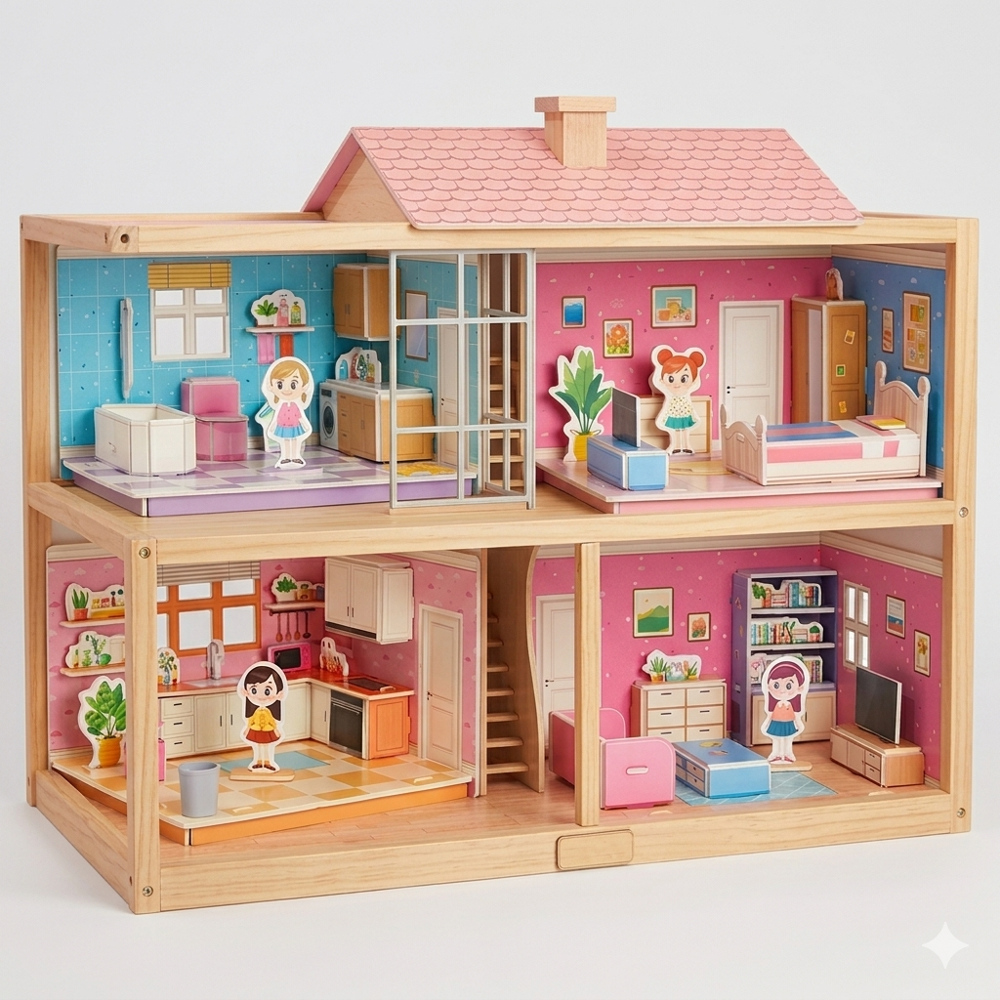

# Mini Smart Home Light Control System
A smart home lighting system is a small demonstration that lets you control 4 room lights using both physical buttons, and a web interface which are all synced in real time through a local database using xampp.

## How it works?
There are 3 main parts that are communicating to each other:
1. **Arduino (Button Controller)** - Reads physical button presses and send the room number to the Wemos via Serial.
2. **Wemos D1 Mini (WiFi Bridge)** — Receives commands from the Arduino, toggles the actual room lights, and syncs everything with a database hosted on XAMPP. (Lights are on based on the reading on XAMPP).
3. **XAMPP + PHP (Web Backend)** — Stores light statuses in a MariaDB database. The PHP endpoints let the Wemos read and update statuses, and also allow control from a browser.

```
[ Physical Buttons ]
        |
        v
   [ Arduino ]  ── Serial (TX/RX) ──>  [ Wemos D1 Mini ]
                                              |
                                         WiFi (HTTP)
                                              |
                                              v
                                      [ XAMPP / MariaDB ]
                                        (Laptop Server)
                                              ^
                                              |
                                        [ Android App ]
                                   (Mobile Control via WiFi)
```
When you press a button on the Arduino, it sends a character (`'1'`, `'2'`, `'3'`, or `'4'`) over Serial to the Wemos. The Wemos toggles the corresponding light and updates the database via an HTTP request. The Wemos also polls the database every second, so if someone changes a light from the Android app, the physical light follows. The Android app uses the same PHP endpoints (`getLightStatus.php` and `setLightStatus.php`) to read and toggle lights over the local WiFi network.

This project uses a house model, specifically the 3D Puzzle Dollhouse Doll House Small you can buy online. Combined together using either cardboard/foam board or wood if available. <br>

<br>
## Rooms
 
| Room         | DB ID | Arduino Button | Arduino LED | Wemos Pin |
|--------------|-------|----------------|-------------|-----------|
| LivingRoom   | 1     | Pin 4          | Pin 8       | D1        |
| Bathroom     | 2     | Pin 5          | Pin 9       | D2        |
| Bedroom      | 3     | Pin 6          | Pin 10      | D3        |
| LaundryRoom  | 4     | Pin 7          | Pin 11      | D4        |

<br>

## Hardware Components
### Arduino Side
- 1x Arduino Uno (or Mega)
- 4x Push buttons
- 4x LEDs (indicators)
- 4x 220Ω resistors
- 1x Breadboard
- Jumper wires

### Wemos Side
- 1x Wemos D1 Mini (ESP8266)
- 4x LEDs (room lights in the house model)
- 4x 220Ω resistors
- Jumper wires

## Software / Libraries Used
- **Arduino IDE** — for uploading code to both boards
- **Arduino_FreeRTOS** — multitasking library for the Arduino
- **ESP8266WiFi** — WiFi library for the Wemos
- **ESP8266HTTPClient** — HTTP requests from the Wemos
- **XAMPP** — local Apache + MariaDB server
- **PHP** — backend API for light status
- **Android Studio** — IDE for building the Android app
- **Kotlin + Jetpack Compose** — Android app UI framework
- **Ktor (CIO)** — HTTP client used by the Android app to call the PHP endpoints
<br>

## Wiring Guide

### Arduino Connections
**Buttons (no external resistors needed — code uses INPUT_PULLUP):**
 
| Button         | Arduino Pin | Other Leg |
|----------------|-------------|-----------|
| LivingRoom     | Pin 4       | GND       |
| Bathroom       | Pin 5       | GND       |
| Bedroom        | Pin 6       | GND       |
| LaundryRoom    | Pin 7       | GND       |
 
**Indicator LEDs (each with a 220Ω resistor to GND):**
 
| LED            | Arduino Pin | Cathode         |
|----------------|-------------|-----------------|
| LivingRoom     | Pin 8       | 220Ω → GND     |
| Bathroom       | Pin 9       | 220Ω → GND     |
| Bedroom        | Pin 10      | 220Ω → GND     |
| LaundryRoom    | Pin 11      | 220Ω → GND     |
 
**Serial to Wemos:**
- Arduino TX (Pin 1) → Wemos RX
- Arduino GND → Wemos GND
<br> 
### Wemos Connections 
**Room LEDs (each with a 220Ω resistor to GND):**
 
| LED            | Wemos Pin | Cathode         |
|----------------|-----------|-----------------|
| LivingRoom     | D1        | 220Ω → GND     |
| Bathroom       | D2        | 220Ω → GND     |
| Bedroom        | D3        | 220Ω → GND     |
| LaundryRoom    | D4        | 220Ω → GND     |

<br>
<br>

## Setup Instructions
 
### 1. Database
1. Open **phpMyAdmin** in XAMPP.
2. Create a database called `smarthomescreen`.
3. Import `database/lights.sql`.
### 2. PHP Files
1. Copy the `php/` folder contents into `C:\xampp\htdocs\IT155\`.
2. Update `connects.php` with your database credentials if needed.
### 3. Wemos Configuration
Open `wemos/wemos_wifi_controller.ino` and update these lines:
```cpp
const char* ssid = "YOUR_WIFI";          // Your WiFi name
const char* password = "YOUR_PASSWORD";  // Your WiFi password
const char* serverIP = "192.168.x.x";   // Your laptop's local IP address
```
 
### 4. Upload Code
1. Upload `arduino/arduino_buttons.ino` to the Arduino using Arduino IDE.
2. Upload `wemos/wemos_wifi_controller.ino` to the Wemos using Arduino IDE (select "LOLIN(WEMOS) D1 R2 & mini" as board).
### 5. Android App
1. Open the `android-app/SmartHomeLightControl/` folder in **Android Studio**.
2. In `MainActivity.kt`, update the IP address to match your laptop's local IP:
```kotlin
val ipAddress = "192.168.x.x"  // Your laptop's local IP address
```
3. Build and install the app on your Android phone.
4. Make sure your phone is connected to the **same WiFi network** as the Wemos and XAMPP server.
### 6. Wire Everything
Connect Arduino to Wemos via Serial (TX → RX, shared GND), then power both boards.
